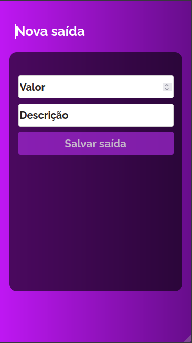

# My Wallet

Acesse a aplicação  [Clicando aqui](https://my-wallet-font.vercel.app/).

## Imagens

  

### `Nova entrada`
 

  

### `Nova saida`

 

  

### `Delete valores incorretos`

Ao clicar no 'x' ao lado do valor uma tela de confirmação será exibida

 

  

Ao confirmar o valor é apagado.

## Sobre o projeto

Projeto da 13ª semana do curso de desenvolvimento web Full Stack da DRIVEN
### Detalhes

    - Projeto de um gerenciador de gastos e ganhos, onde foi desenvolvido o front e o back.

    -O DataBase encontra-se hospedada no MongoAtlas

    -O back-End encontra-se hospedado no Heroku

    - É gerado um token a cada
  
    - Ao deslogar o token é invalidado, impedindo seu uso novamente
### Repositorio do Back-End

Acesse o repositorio do github [clicando aqui](https://github.com/Vmatos98/myWallet-back)

